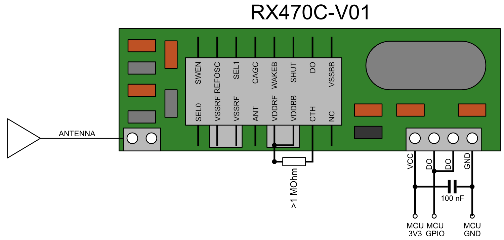

# MPY-RF

## Enhancing the reception of RX470C modules

The RX470C-V01 module is a low cost (~2 €) 433 MHz receiver for use with microcontrollers (MCUs).
I used it to receive data from an outdoor temperature sensor.
During my work on this small project I could identify several factors which improve reception of rf data specifically with RX470C modules.
Most importantly: Adding just one resistor to the module may eradicate noise almost completely.

## Hardware Setup
The RX470C-V01 module (RX) only needs one GPIO pin for data transmission.
It can be supplied with either 5V or 3.3V.
RX has two identical digital output (DO) pins, either of them may be used.

Exemplary connections:
- RX_GND --> MCU_GND
- RX_VCC --> MCU_3V3
- RX_DO  --> MCU_GPIO14

The program was tested on a Raspberry Pi Pico and on an Esp32-WROVER-B running MicroPython v1.23.0.

## The Problem: Noise
The main problem for receiving rf data with microcontrollers is reception of ambient noise.
During idle periods the digital output (DO) pin of the receiver transitions randomly between 1 and 0.

Peter Hinch's mpyremote (used to record signals of remote power plugs) overcomes this problem by manually starting to record data.
The rf signal has to be present already when the user starts the recording procedure. 
To record data, the state of the DO pin is retrieved by polling it in a loop.
Therefore, the program doesn't rely on IRQs which can problematic.
The recorded data is then analyzed. Similar transmissions are identified and the frames are averaged.
Unfortunately, this approach didn't work for my problem since my program has to wait for periodic transmissions and identify them.

## Solution: Analog noise reduction + IRQs

Although I understand the problems related to the use of IRQs, I found that IRQs result in a more precise timing in my case.
I managed to find a datasheet of the SYN470R IC which is most likely used on the RX470C modules.
The SYN470R IC offers analog noise reduction which can be activated by simply ading a several Megaohm resistor (6 - 10 MOhm) between two pins of the IC.
Furthermore, a supply bypass capacitor should be added between the modules power supply pins.

I added a supply bypass capacitor and a 1 MOhm resistor to my module and tadaa - the noise in idle state was gone.
The figure below shows where to add the resistor. 
You may have to vary the values of the resistor until the desired noise reduction is achieved.

Although the datasheet suggests resistors with 6 - 10 MOhm, a 1 MOhm resistor gave me perfect results.
I tried higher values but this resulted in a complete loss of reception.
Also, I connected the RX module to the mcu's 3.3V supply instead of the USB's 5V pin since the mcu's supply might be more stable.

To sum it up, the following considerations may improve reception:
- Activate analog noise suppression by adding a resistor
- Use a supply bypass capacitor
- Use the 3.3V supply of the mcu and not USB 5V supply
- Use the antenna supplied with the module
- Kepp the data connection between RX module and MCU short

Stuff that didn't work:
- Polling the DO pin's state in a loop
- Using machine.time_puls_us
- Activating hardware interrupts (vs. software interrupts) made no difference
