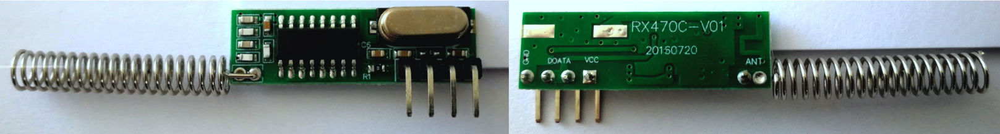

# MPY-RF

## Enhancing the reception of RX470C modules

The RX470C-V01 module is a low cost (~2 €) 433 MHz receiver for use with microcontrollers (MCUs).
I used it to receive data from an outdoor temperature sensor.
During my work on this small project I could identify several factors which improve reception of rf data specifically with RX470C modules.
Most importantly: Adding just one resistor to the module may eradicate noise almost completely.

## The Problem: Noise
The main problem for receiving rf data with microcontrollers is reception of ambient noise.
During idle periods the digital output (DO) pin of the receiver transitions randomly between 1 and 0.

Peter Hinch's mpyremote (used to record signals of remote power plugs) overcomes this problem by manually starting to record data.
The rf signal has to be present already when the user starts the recording procedure. 
To record data, the state of the DO pin is retrieved by polling it in a loop.
Therefore, the program doesn't rely on IRQs which can problematic.
The recorded data is then analyzed. Similar transmissions are identified and the frames are averaged.
Unfortunately, this approach didn't work for my problem since my program has to wait for periodic transmissions and identify them.

## Solution: Analog noise reduction + IRQs

Although I understand the problems related to the use of IRQs, I found that IRQs result in a more precise timing in my case.
I managed to find a datasheet of the SYN470R IC which is most likely used on the RX470C modules.
The SYN470R IC offers analog noise reduction which can be activated by simply ading a several Megaohm resistor (6 - 10 MOhm) between two pins of the IC.
Furthermore, a supply bypass capacitor should be added between the modules power supply pins.

I added a supply bypass capacitor and a 1 MOhm resistor to my module and tadaa - the noise in idle state was gone.
